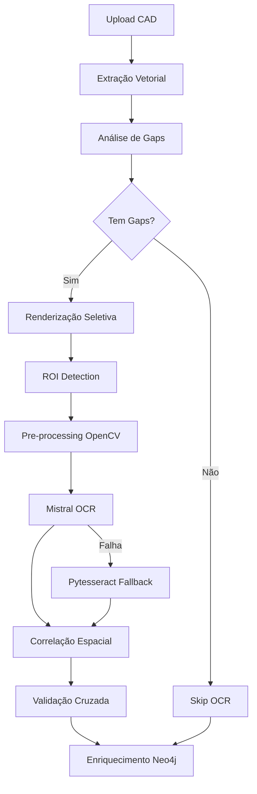

# 🔍 Arquitetura de Enriquecimento OCR + OpenCV para CAD Graph Platform

## 📋 Análise Crítica da Proposta Original

### Pontos Fortes do Design Dual-Motor
✅ **Resiliência**: Fallback automático para Pytesseract
✅ **Modularidade**: Componentes desacoplados e escaláveis
✅ **Precisão**: Mistral AI como motor primário de alta qualidade

### Limitações Identificadas para Nosso Caso de Uso

1. **Especificidade CAD**: A proposta original é genérica para documentos, não otimizada para desenhos técnicos
2. **Desperdício de Processamento**: Executar OCR em elementos já extraídos pelo parser CAD (TEXT/MTEXT)
3. **Falta de Correlação Espacial**: Não aproveita coordenadas dos elementos CAD para guiar o OCR
4. **Processamento Indiscriminado**: OCR em toda a imagem, não em regiões de interesse (ROIs)
5. **Ausência de Validação Cruzada**: Não compara resultados OCR com dados vetoriais

## 🎯 Nova Proposta: Arquitetura OCR Inteligente para CAD

### Princípios Fundamentais

1. **OCR Complementar, Não Duplicativo**: Focar apenas em texto não capturado pelos parsers CAD
2. **Correlação Espacial**: Usar coordenadas CAD para identificar ROIs prioritárias
3. **Validação Cruzada**: Comparar OCR vs dados vetoriais para garantir qualidade
4. **Processamento Seletivo**: OCR apenas onde agregar valor real

### Arquitetura Proposta



## 🔧 Componentes Detalhados

### 1. Analisador de Gaps (`gap_analyzer.py`)
```python
class CadGapAnalyzer:
    """
    Identifica áreas do desenho que podem conter texto não extraído
    """
    
    def analyze_coverage(self, cad_entities: List[Dict], drawing_bounds: Dict) -> List[Region]:
        """
        Retorna regiões do desenho sem cobertura de entidades TEXT/MTEXT
        """
        # 1. Criar mapa de densidade de texto
        text_density_map = self._create_text_density_map(cad_entities)
        
        # 2. Identificar "vazios suspeitos"
        suspicious_regions = []
        
        # Regiões típicas que contêm texto em CAD:
        # - Cantos (title blocks)
        # - Bordas (legendas)
        # - Áreas com alta densidade de linhas (dimensões)
        
        return suspicious_regions
    
    def prioritize_regions(self, regions: List[Region]) -> List[Region]:
        """
        Prioriza regiões baseado em probabilidade de conter texto importante
        """
        # Critérios de priorização:
        # 1. Proximidade a elementos DIMENSION
        # 2. Padrões de layout (title block, legends)
        # 3. Densidade de elementos gráficos
        return sorted(regions, key=lambda r: r.priority, reverse=True)
```

### 2. Renderizador Seletivo (`selective_renderer.py`)
```python
class SelectiveCADRenderer:
    """
    Renderiza apenas regiões específicas do CAD como imagem
    """
    
    def render_regions(self, dxf_path: Path, regions: List[Region]) -> List[RenderedRegion]:
        """
        Usa ezdxf drawing addon para renderizar ROIs específicas
        """
        import ezdxf
        from ezdxf.addons.drawing import RenderContext, Frontend
        from PIL import Image
        
        doc = ezdxf.readfile(dxf_path)
        msp = doc.modelspace()
        
        rendered_regions = []
        for region in regions:
            # Configurar viewport para a região
            ctx = RenderContext(doc)
            ctx.set_current_layout(msp)
            
            # Renderizar apenas a região de interesse
            backend = PILBackend()
            frontend = Frontend(ctx, backend)
            frontend.draw_region(region.bounds)
            
            rendered_regions.append(RenderedRegion(
                region=region,
                image=backend.get_image(),
                resolution=300  # DPI para OCR
            ))
            
        return rendered_regions
```

### 3. Processador OCR Contextual (`contextual_ocr_processor.py`)
```python
class ContextualOCRProcessor:
    """
    OCR com consciência do contexto CAD
    """
    
    def __init__(self):
        self.mistral_client = MistralOCRClient()
        self.preprocessor = CADImagePreprocessor()
        
    async def process_region(self, rendered_region: RenderedRegion, context: CADContext) -> OCRResult:
        """
        Processa uma região com OCR contextualizado
        """
        # 1. Pré-processamento específico para CAD
        processed_image = self.preprocessor.prepare_for_ocr(
            rendered_region.image,
            context_type=context.region_type  # 'title_block', 'dimension', 'legend'
        )
        
        # 2. OCR com prompt contextual para Mistral
        ocr_prompt = self._build_contextual_prompt(context)
        
        try:
            result = await self.mistral_client.extract_text(
                image=processed_image,
                prompt=ocr_prompt,
                expected_patterns=context.expected_patterns
            )
            
            # 3. Pós-processamento específico do domínio
            result = self._apply_domain_rules(result, context)
            
        except MistralAPIError as e:
            # Fallback para Pytesseract com configuração otimizada
            result = self._pytesseract_fallback(processed_image, context)
            
        return result
    
    def _build_contextual_prompt(self, context: CADContext) -> str:
        """
        Cria prompt específico para o tipo de região
        """
        prompts = {
            'title_block': "Extract project information, scale, date, and drawing number from this title block",
            'dimension': "Extract dimension values and their associated measurements",
            'legend': "Extract legend items with their colors and descriptions",
            'annotation': "Extract technical annotations and specifications"
        }
        return prompts.get(context.region_type, "Extract all text from this technical drawing region")
```

### 4. Validador Cruzado (`cross_validator.py`)
```python
class OCRCrossValidator:
    """
    Valida e correlaciona resultados OCR com dados CAD existentes
    """
    
    def validate_ocr_results(self, ocr_results: List[OCRResult], cad_entities: List[Dict]) -> ValidationReport:
        """
        Compara OCR com dados vetoriais para garantir consistência
        """
        validations = []
        
        for ocr_result in ocr_results:
            # 1. Encontrar entidades CAD próximas
            nearby_entities = self._find_nearby_entities(
                ocr_result.position,
                cad_entities,
                threshold=5.0  # unidades de desenho
            )
            
            # 2. Validar consistência
            if nearby_entities:
                validation = self._compare_text(ocr_result.text, nearby_entities)
                if validation.confidence < 0.8:
                    # Possível discrepância - requer análise
                    validation.flag = 'REVIEW_REQUIRED'
            else:
                # Novo texto descoberto
                validation.flag = 'NEW_DISCOVERY'
                
            validations.append(validation)
            
        return ValidationReport(validations)
```

### 5. Enriquecedor de Grafos (`graph_enricher.py`)
```python
class OCRGraphEnricher:
    """
    Enriquece Neo4j com dados OCR validados e contextualizados
    """
    
    def enrich_graph(self, ocr_results: List[ValidatedOCRResult], session: Neo4jSession):
        """
        Adiciona nós e relacionamentos OCR ao grafo
        """
        # Novos tipos de nós
        for result in ocr_results:
            if result.validation_flag == 'NEW_DISCOVERY':
                # Criar novo nó OCRText
                session.run("""
                    MATCH (f:Floor {uid: $floor_uid})
                    CREATE (ocr:OCRText {
                        uid: $uid,
                        text: $text,
                        confidence: $confidence,
                        position: point({x: $x, y: $y}),
                        region_type: $region_type,
                        discovery_method: 'OCR',
                        validated: $validated
                    })
                    CREATE (f)-[:HAS_OCR_TEXT]->(ocr)
                """, **result.to_dict())
                
            elif result.validation_flag == 'ENHANCEMENT':
                # Enriquecer nó existente
                session.run("""
                    MATCH (a:Annotation {uid: $annotation_uid})
                    SET a.ocr_enhanced_text = $enhanced_text,
                        a.ocr_confidence = $confidence,
                        a.has_ocr_validation = true
                """, **result.to_dict())
                
        # Criar relacionamentos de correlação
        self._create_correlation_relationships(ocr_results, session)
```

## 📊 Schema Neo4j Enriquecido

### Novos Tipos de Nós
```cypher
// Texto descoberto via OCR
(:OCRText {
    uid: String,
    text: String,
    confidence: Float,
    position: Point,
    region_type: String,  // 'title_block', 'dimension', 'legend'
    source_engine: String,  // 'mistral' ou 'pytesseract'
    extraction_timestamp: DateTime
})

// Bloco de título estruturado
(:TitleBlock {
    uid: String,
    project_name: String,
    project_code: String,
    scale: String,
    date: Date,
    revision: String,
    extracted_via: String  // 'CAD' ou 'OCR'
})

// Informação dimensional enriquecida
(:EnrichedDimension {
    uid: String,
    value: Float,
    unit: String,
    tolerance: String,
    correlated_with: String[]  // UIDs de elementos relacionados
})
```

### Novos Relacionamentos
```cypher
// Correlações OCR-CAD
(:OCRText)-[:VALIDATES {confidence: Float}]->(:Annotation)
(:OCRText)-[:ENHANCES]->(:Feature)
(:Floor)-[:HAS_TITLE_BLOCK]->(:TitleBlock)
(:EnrichedDimension)-[:MEASURES]->(:WallSegment)
```

## 🚀 Pipeline de Implementação

### Fase 1: Análise e Renderização (1 semana)
```python
# 1. gap_analyzer.py - Identificar regiões sem texto
# 2. selective_renderer.py - Renderizar apenas ROIs
# 3. Testes com arquivos CAD reais
```

### Fase 2: OCR Contextual (2 semanas)
```python
# 1. mistral_ocr_client.py - Integração com API
# 2. contextual_ocr_processor.py - Lógica de processamento
# 3. pytesseract_fallback.py - Sistema de contingência
```

### Fase 3: Validação e Enriquecimento (1 semana)
```python
# 1. cross_validator.py - Validação CAD vs OCR
# 2. graph_enricher.py - Atualização Neo4j
# 3. quality_metrics.py - Dashboard de qualidade
```

## 📈 Métricas de Sucesso

### KPIs Propostos
1. **Taxa de Descoberta**: % de novo texto encontrado via OCR
2. **Precisão de Correlação**: % de matches corretos CAD-OCR
3. **Tempo de Processamento**: < 30s para desenho típico
4. **Taxa de Fallback**: < 5% de uso do Pytesseract
5. **Qualidade de Dados**: > 95% de confiança média

## 🔐 Considerações de Segurança e Performance

### Otimizações
1. **Cache de Renderização**: Reutilizar imagens renderizadas
2. **Processamento Paralelo**: ROIs processadas em paralelo
3. **Batch Processing**: Agrupar múltiplas regiões para Mistral
4. **Skip Inteligente**: Pular OCR quando desnecessário

### Segurança
1. **Sanitização de Dados**: Validar todo texto extraído
2. **Rate Limiting**: Controlar chamadas à API Mistral
3. **Isolamento de Processamento**: Containers separados
4. **Auditoria**: Log completo de todas as extrações

## 💡 Diferenciais da Nova Arquitetura

1. **Inteligência Contextual**: OCR guiado por análise CAD
2. **Eficiência**: Processa apenas onde agrega valor
3. **Validação Integrada**: Garante qualidade dos dados
4. **Especialização CAD**: Otimizado para desenhos técnicos
5. **Escalabilidade Seletiva**: Recursos sob demanda

Esta arquitetura resolve as limitações da proposta original ao focar especificamente nas necessidades de processamento CAD, eliminando redundâncias e maximizando o valor agregado do OCR.