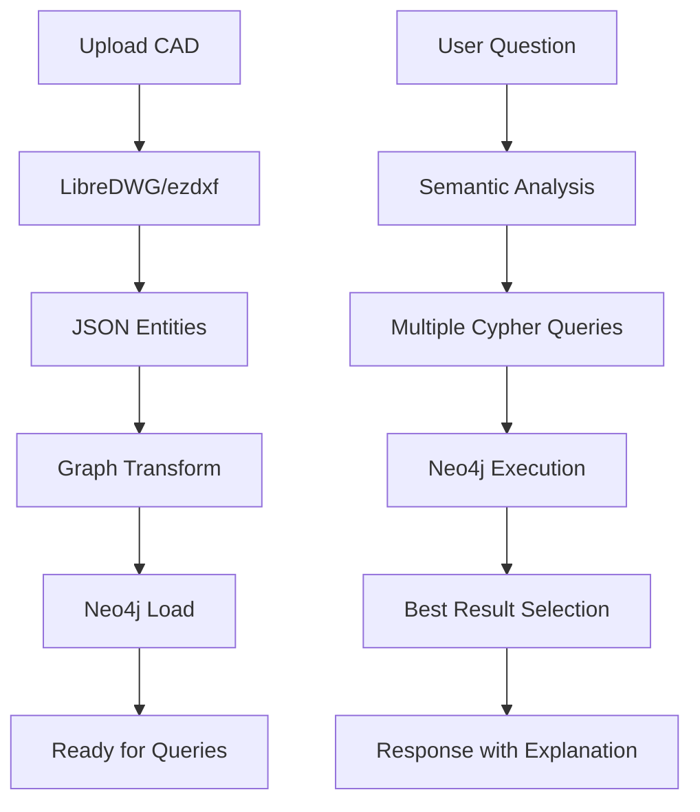

# CAD Graph Platform 🏗️

> **Sistema Inteligente de Análise de Documentos CAD**  
> Transforma arquivos DWG/DXF em grafos Neo4j pesquisáveis por linguagem natural

[](https://www.python.org/)
[](https://fastapi.tiangolo.com/)
[](https://neo4j.com/)
[](https://reactjs.org/)
[](https://www.docker.com/)

## 📋 Índice

- [Visão Geral](#-visão-geral)
- [Funcionalidades](#-funcionalidades)
- [Tecnologias](#-tecnologias)
- [Instalação](#-instalação)
- [Uso](#-uso)
- [API Reference](#-api-reference)
- [Arquitetura](#-arquitetura)
- [Desenvolvimento](#-desenvolvimento)
- [Contribuição](#-contribuição)

## 🎯 Visão Geral

O **CAD Graph Platform** é uma solução avançada que permite **análise inteligente de plantas baixas** através de:

- **Extração automatizada** de dados de arquivos CAD (DWG/DXF)
- **Modelagem em grafo** para preservar relacionamentos espaciais
- **Interface de linguagem natural** para consultas sem conhecimento técnico
- **IA semântica** que entende contexto e correlações

### 🎪 Demonstração

```bash
# Usuário pergunta em linguagem natural
"Qual o nome do projeto?"

# Sistema busca automaticamente em:
✅ Nome do Building
✅ Códigos em annotations 
✅ Títulos em textos grandes
✅ Padrões de nomenclatura

# Resultado inteligente
"ECB1-EST-AP-CORP-221-PV32-R00 (Torre Corporativa)"
```

## ✨ Funcionalidades

### 🔄 **Processamento de Arquivos**
- **Suporte completo** para DWG e DXF
- **Extração estruturada** usando LibreDWG e ezdxf
- **Transformação automática** para modelo de grafo
- **Preservação de metadados** (escalas, layers, coordenadas)

### 🧠 **IA Semântica Avançada**
- **Detecção de intenção** em perguntas naturais
- **Correlações automáticas** entre diferentes fontes
- **Múltiplas estratégias** de busca simultâneas
- **Fallback inteligente** quando IA principal falha

### 🔍 **Consultas Inteligentes**
- **Linguagem natural** em português e inglês
- **Interpretação semântica** de termos técnicos
- **Busca correlacionada** em múltiplas entidades
- **Explicações automáticas** do processo de busca

### 📊 **Interface Rica**
- **Upload drag-and-drop** de arquivos CAD
- **Chat interativo** para consultas
- **Visualização de resultados** estruturados
- **Sugestões contextuais** de perguntas

## 🛠️ Tecnologias

### Backend
- **[FastAPI](https://fastapi.tiangolo.com/)** - Framework web moderno e rápido
- **[Neo4j](https://neo4j.com/)** - Banco de dados em grafo
- **[LibreDWG](https://www.gnu.org/software/libredwg/)** - Processamento de DWG
- **[ezdxf](https://ezdxf.mozman.at/)** - Processamento de DXF
- **[OpenAI GPT-4o](https://openai.com/)** - Conversão de linguagem natural

### Frontend
- **[React 19](https://reactjs.org/)** - Interface de usuário
- **[TypeScript](https://www.typescriptlang.org/)** - Tipagem estática
- **[Vite](https://vitejs.dev/)** - Build tool otimizado
- **[TailwindCSS](https://tailwindcss.com/)** - Framework CSS
- **[Tanstack Query](https://tanstack.com/query)** - Gerenciamento de estado

### Infraestrutura
- **[Docker](https://www.docker.com/)** - Containerização
- **[Docker Compose](https://docs.docker.com/compose/)** - Orquestração de múltiplos containers
- **[Python 3.11](https://www.python.org/)** - Runtime principal para o backend

## 🚀 Instalação

### Pré-requisitos
- **Docker** e **Docker Compose**
- **Git**
- **8GB RAM** (recomendado)

### 1. Clone o Repositório
```bash
git clone https://github.com/seu-usuario/cad-graph-platform.git
cd cad-graph-platform
```

### 2. Configure Variáveis de Ambiente
```bash
# Copie o arquivo de exemplo
cp .env.example .env

# Configure sua API key do OpenAI
echo "OPENAI_API_KEY=sk-your-key-here" >> .env
```

### 3. Inicie os Serviços
```bash
# Construa e inicie todos os serviços em segundo plano
docker compose up --build -d

# Aguarde a inicialização (pode levar alguns minutos)
```

### 4. Acesse a Aplicação
- **Interface Principal (Frontend)**: http://localhost:8080
- **API Principal (Backend)**: http://localhost:8000
- **Neo4j Browser**: http://localhost:7474
- **API Documentation**: http://localhost:8000/docs

## 📖 Uso

### Upload de Arquivo
1. Acesse http://localhost:8000
2. Clique na área de upload ou arraste um arquivo DWG/DXF
3. Aguarde o processamento automático

### Consultas Inteligentes
```
💬 Exemplos de Perguntas:

📋 Informações do Projeto:
• "Qual o nome do projeto?"
• "Qual é o código do projeto?"
• "Que tipo de projeto é este?"

📏 Escalas e Medidas:
• "Qual a escala do projeto?"
• "Quais são as dimensões principais?"

🏗️ Elementos Arquitetônicos:
• "Quantas salas tem o projeto?"
• "Onde estão as paredes?"
• "Tem escadas no desenho?"

📊 Análise de Dados:
• "Que tipos de elementos tem no desenho?"
• "Quais são as anotações principais?"
```

### Consultas Avançadas

#### Endpoint Semântico
```bash
curl -X POST http://localhost:8000/api/smart-query \
  -H "Content-Type: application/json" \
  -d '{"question": "Qual o nome do projeto?"}'
```

#### Sugestões Automáticas
```bash
curl http://localhost:8000/api/suggest-questions
```

## 📚 API Reference

### 🔄 Upload
```http
POST /api/upload
Content-Type: multipart/form-data

file: arquivo.dwg
```
**Response:**
```json
{
  "message": "File processed successfully",
  "file_path": "/uploads/arquivo.dwg",
  "entities_extracted": 2500,
  "nodes_created": 1800,
  "relationships_created": 3200
}
```

### 🧠 Query Semântica
```http
POST /api/smart-query
Content-Type: application/json

{
  "question": "Qual o nome do projeto?"
}
```
**Response:**
```json
{
  "interpretation": {
    "detected_intent": "project_info",
    "semantic_terms": ["nome do projeto"],
    "explanation": "Searching for project information..."
  },
  "primary_result": {
    "description": "Nome do projeto do Building",
    "cypher": "MATCH (b:Building) RETURN b.name",
    "results": [{"project_name": "ECB1-EST-AP-CORP-221"}]
  },
  "alternative_results": [...],
  "explanation": "Interpretei sua pergunta como busca por informações do projeto..."
}
```

### 💡 Sugestões
```http
GET /api/suggest-questions
```
**Response:**
```json
{
  "data_summary": [
    {"types": ["Building"], "count": 1},
    {"types": ["Annotation"], "count": 450}
  ],
  "suggested_questions": [
    {
      "category": "Informações do Projeto",
      "questions": ["Qual o nome do projeto?", ...]
    }
  ],
  "tips": ["Você pode perguntar em português ou inglês", ...]
}
```

## 🏗️ Arquitetura

### Diagrama de Componentes
```
┌─────────────────┐     ┌─────────────────┐
│   React Frontend│────▶│  FastAPI Backend │
│   (Port 8000)   │     │   (Port 8000)    │
└─────────────────┘     └────────┬────────┘
                                │
                                ▼
                        ┌─────────────────┐
                        │   Neo4j Graph   │
                        │   (Port 7474)   │
                        └─────────────────┘
```

### Fluxo de Dados


### Modelo de Dados
```cypher
// Schema do Grafo Neo4j
(:Building)-[:HAS_FLOOR]->(:Floor)
(:Building)-[:HAS_METADATA]->(:Metadata)
(:Floor)-[:HAS_SPACE]->(:Space)
(:Floor)-[:HAS_WALL]->(:WallSegment)
(:Floor)-[:HAS_FEATURE]->(:Feature)
(:Floor)-[:HAS_ANNOTATION]->(a:Annotation)

// Propriedades principais
Building: name, uid
Floor: name, level
Space: raw_points, point_count, layer
WallSegment: start_x/y/z, end_x/y/z, layer
Annotation: text, insert_x/y/z, height, layer
```

## 💻 Desenvolvimento

### Estrutura do Projeto
```
cad-graph-platform/
├── app/                           # Backend Python
│   ├── main.py                   # FastAPI application
│   ├── data_extraction.py        # DWG/DXF processing
│   ├── graph_loader.py           # Neo4j integration
│   ├── query_interface.py        # OpenAI integration
│   ├── semantic_query_enhancer.py # IA semântica
│   └── static/                   # Frontend build
├── frontend/                      # React application
│   ├── src/
│   │   ├── components/           # React components
│   │   ├── lib/                  # API client
│   │   └── types/                # TypeScript types
│   ├── Dockerfile                # Container definition para o frontend
│   ├── nginx.conf                # Configuração Nginx para o frontend
│   └── package.json
├── docker-compose.yml            # Orquestração de serviços Docker
├── Dockerfile.from-existing      # Dockerfile principal do backend
├── requirements.txt              # Dependências Python
├── libredwg-service/             # Serviço de processamento DWG
│   └── Dockerfile.optimized      # Dockerfile otimizado para o serviço LibreDWG
└── memory-bank/                  # Documentação
```

### Comandos de Desenvolvimento

#### Backend
```bash
# Desenvolver backend localmente
cd app
pip install -r requirements.txt
uvicorn main:app --reload --host 0.0.0.0 --port 8000
```

#### Frontend
```bash
# Desenvolver frontend
cd frontend
npm install
npm run dev  # http://localhost:3000
```

#### Build de Produção
```bash
# Build completo dos containers
docker compose up --build
```

### Configuração de Desenvolvimento

#### Variáveis de Ambiente
```bash
# .env
OPENAI_API_KEY=sk-your-key-here
NEO4J_URI=bolt://localhost:7687
NEO4J_USER=neo4j
NEO4J_PASSWORD=password123
```

#### Debugging
```bash
# Logs dos containers
docker-compose logs -f app       # Backend logs
docker-compose logs -f neo4j     # Database logs

# Acesso ao Neo4j Browser
# http://localhost:7474
# user: neo4j, password: password123
```

## 🔧 Sistema Semântico

### Detecção de Intenção
O sistema classifica perguntas em categorias:

```python
# Tipos de intenção suportados
- project_info:     "nome do projeto", "código"
- scale_info:       "escala", "medidas"  
- count_query:      "quantos", "número"
- element_search:   "paredes", "salas"
- general_exploration: exploração geral
```

### Mapeamento Semântico
```python
# Correlações automáticas
"nome do projeto" → [
    "project name", "project title", 
    "nome", "titulo", "código"
]

"escala" → [
    "scale", "proportion", "esc",
    "1:50", "ESC: 1:1000"
]

"parede" → [
    "wall", "walls", "muro",
    WallSegment entities
]
```

### Queries Múltiplas
Para cada pergunta, o sistema gera 3+ abordagens:

```cypher
-- "Qual o nome do projeto?"
-- Abordagem 1: Building name
MATCH (b:Building) RETURN b.name

-- Abordagem 2: Códigos em annotations
MATCH (a:Annotation) 
WHERE a.text =~ '.*[A-Z]{2,}\\d+-[A-Z]{2,}.*' 
RETURN a.text

-- Abordagem 3: Títulos em textos grandes
MATCH (a:Annotation) 
WHERE length(a.text) > 10 
  AND toLower(a.text) CONTAINS 'projeto'
RETURN a.text
```

## 🧪 Testes

### Executar Testes
```bash
# Testes backend
docker exec cad_app python -m pytest

# Testes frontend  
cd frontend && npm test

# Testes de integração
docker-compose -f docker-compose.test.yml up
```

### Casos de Teste
- ✅ Upload DWG/DXF válidos
- ✅ Extração de entidades
- ✅ Transformação para grafo
- ✅ Queries semânticas
- ✅ Fallback quando IA falha

## 📈 Performance

### Benchmarks
- **Upload 50MB DWG**: ~30 segundos
- **Extração 5000 entidades**: ~45 segundos  
- **Query simples**: <500ms
- **Query semântica**: <2 segundos

### Otimizações
- **Processamento paralelo** de entidades
- **Cache de queries** frequentes
- **Índices Neo4j** otimizados
- **Frontend build** minificado

## 🔒 Segurança

### Práticas Implementadas
- ✅ **Validação de tipos** de arquivo
- ✅ **Sanitização de uploads**
- ✅ **Rate limiting** em APIs
- ✅ **Environment secrets**
- ✅ **CORS configurado**

### Considerações
- API keys não são expostas no frontend
- Uploads limitados a tipos CAD
- Queries Cypher validadas antes da execução

## 🚢 Deploy

### Docker Compose (Recomendado)
```bash
# Produção
docker-compose -f docker-compose.prod.yml up -d

# Monitoramento
docker-compose ps
docker-compose logs -f
```

### Configurações de Produção
```yaml
# docker-compose.prod.yml
services:
  app:
    environment:
      - ENVIRONMENT=production
      - DEBUG=false
    restart: unless-stopped
    
  neo4j:
    environment:
      - NEO4J_dbms_memory_heap_max__size=2G
    restart: unless-stopped
```

## 🤝 Contribuição

### Como Contribuir
1. **Fork** o repositório
2. **Crie** uma branch: `git checkout -b feature/nova-funcionalidade`
3. **Commit** suas mudanças: `git commit -m 'Add: nova funcionalidade'`
4. **Push** para a branch: `git push origin feature/nova-funcionalidade`
5. **Abra** um Pull Request

### Diretrizes
- Código deve seguir padrões **PEP 8** (Python) e **ESLint** (TypeScript)
- **Testes** obrigatórios para novas funcionalidades
- **Documentação** atualizada para mudanças de API
- **Commit messages** seguindo padrão conventional

### Issues
- 🐛 **Bugs**: Reporte com reprodução detalhada
- ✨ **Features**: Discuta propostas antes de implementar
- 📚 **Docs**: Melhorias na documentação são bem-vindas

## 📄 Licença

Este projeto está sob a licença **MIT**. Veja o arquivo [LICENSE](LICENSE) para detalhes.

## 🙏 Agradecimentos

- **[LibreDWG](https://www.gnu.org/software/libredwg/)** - Processamento de arquivos DWG
- **[ezdxf](https://ezdxf.mozman.at/)** - Biblioteca Python para DXF
- **[Neo4j](https://neo4j.com/)** - Banco de dados em grafo
- **[OpenAI](https://openai.com/)** - Modelos de linguagem
- **Comunidade Open Source** - Inspiração e ferramentas

## 📞 Suporte

### Documentação
- 📖 **[Memory Bank](memory-bank/)** - Documentação técnica detalhada
- 🎯 **[API Docs](http://localhost:8000/docs)** - Documentação interativa da API
- 🧠 **[Sistema Semântico](memory-bank/semantic-ai-enhancement-system.md)** - IA Avançada

### Contato
- 🌐 **Website**: [Seu site]
- 📧 **Email**: [seu-email@exemplo.com]
- 💬 **Issues**: [GitHub Issues](https://github.com/seu-usuario/cad-graph-platform/issues)

---

<div align="center">

**[⬆ Voltar ao Topo](#cad-graph-platform-️)**

Feito com ❤️ para a comunidade de engenharia e arquitetura

</div>