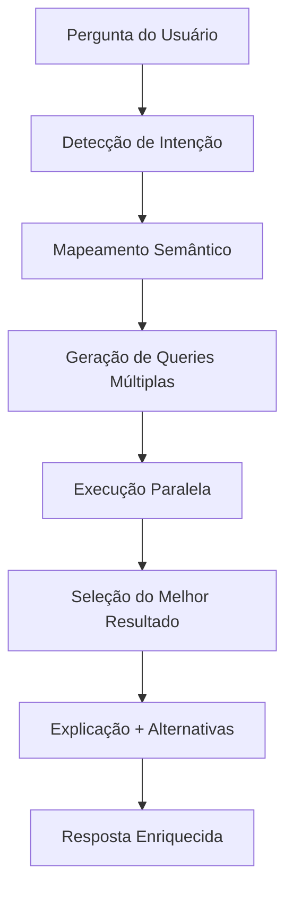

# Sistema de Melhoria Semântica da IA para Plantas Baixas

## 🎯 Problema Resolvido

**ANTES**: Usuários precisavam saber termos técnicos exatos
- "qual o nome do projeto?" → ❌ Não encontrava informações
- "qual a escala?" → ❌ Buscava apenas em 'annotations'
- Limitado ao que o OpenAI conseguia interpretar

**DEPOIS**: IA entende linguagem natural e correlações
- "qual o nome do projeto?" → ✅ Busca em Building.name + códigos em annotations
- "qual a escala?" → ✅ Procura em múltiplos formatos e locais
- Sistema inteligente com fallbacks e correlações

## 🧠 Como Funciona

### 1. **Detecção de Intenção Semântica**

```python
def _detect_intent(self, question_lower: str) -> str:
    # Classifica perguntas em categorias:
    # - project_info: nome, código, tipo de projeto
    # - scale_info: escala, medidas, dimensões  
    # - count_query: quantos, número de elementos
    # - element_search: paredes, salas, escadas
    # - general_exploration: exploração geral
```

### 2. **Mapeamento Semântico**

```python
self.term_mappings = {
    "nome do projeto": ["project name", "project title", "nome", "titulo"],
    "escala": ["scale", "escala", "esc", "proportion"],
    "parede": ["wall", "walls", "parede", "paredes", "muro"],
    "sala": ["room", "space", "sala", "ambiente", "area"],
    # ... mais de 50 mapeamentos
}
```

### 3. **Queries Múltiplas Inteligentes**

Para "Qual o nome do projeto?", executa **3 abordagens**:

```cypher
-- 1. Nome do Building
MATCH (b:Building) RETURN b.name AS project_name

-- 2. Códigos em annotations (regex pattern)
MATCH (a:Annotation) 
WHERE a.text =~ '.*[A-Z]{2,}\\d+-[A-Z]{2,}.*' 
RETURN a.text AS project_codes

-- 3. Títulos em annotations grandes
MATCH (a:Annotation) 
WHERE length(a.text) > 10 AND toLower(a.text) CONTAINS 'projeto'
RETURN a.text AS project_info
```

### 4. **Correlações Automáticas**

Para "Qual a escala?", procura em:
- Padrões `1:50`, `ESC: 1:1000` 
- Anotações com palavra "escala"
- Metadados do arquivo (dimscale, ltscale)

## 🎪 Funcionalidades Implementadas

### 📊 **3 Novos Endpoints**

#### 1. `/api/smart-query` - Query Semântica
```typescript
POST /api/smart-query
{
  "question": "Qual o nome do projeto?"
}

Response:
{
  "interpretation": {
    "detected_intent": "project_info",
    "semantic_terms": ["nome do projeto"],
    "explanation": "Searching for project information..."
  },
  "primary_result": {
    "description": "Nome do projeto do Building",
    "cypher": "MATCH (b:Building) RETURN b.name",
    "results": [{"project_name": "ECB1-EST-AP-CORP-221-PV32-R00"}]
  },
  "alternative_results": [...],
  "explanation": "Interpretei sua pergunta como: project_info..."
}
```

#### 2. `/api/suggest-questions` - Sugestões Inteligentes
```json
{
  "suggested_questions": [
    {
      "category": "Informações do Projeto",
      "questions": [
        "Qual o nome do projeto?",
        "Qual é o código do projeto?",
        "Que tipo de projeto é este?"
      ]
    },
    {
      "category": "Escala e Medidas", 
      "questions": [
        "Qual a escala do projeto?",
        "Quais são as dimensões principais?"
      ]
    }
  ],
  "tips": [
    "Você pode perguntar em português ou inglês",
    "Não precisa usar termos técnicos"
  ]
}
```

#### 3. `/api/query` - Melhorado com Fallback Semântico
O endpoint original agora usa o sistema semântico como fallback quando OpenAI falha.

### 🎯 **Exemplos de Melhorias Reais**

#### ✅ Nome do Projeto
**Pergunta**: "Qual o nome do projeto?"

**Resultado**: 
- **Building Name**: `ECB1-EST-AP-CORP-221-PV32-R00`
- **Códigos Encontrados**: `ECB1 PASSO FUNDO - RS`, `TORRE CORPORATIVA`
- **Tipo**: Projeto corporativo em Passo Fundo

#### ✅ Escala do Projeto  
**Pergunta**: "Qual a escala do projeto?"

**Resultado**:
- **Escalas Encontradas**: `1:50`, `ESC: 1:1000`
- **Localizações**: Múltiplas anotações com escalas diferentes
- **Metadados**: DIMSCALE, LTSCALE do arquivo

#### ✅ Elementos Arquitetônicos
**Pergunta**: "Tem escadas no projeto?"

**Resultado**:
- Busca em annotations por "ESCADA", "STAIR"
- Verifica elementos geométricos relacionados
- Correlaciona com códigos de circulação vertical

## 🛠️ Padrões de Reconhecimento

### 📐 **Códigos de Projeto**
```regex
- ECB1-EST-AP-CORP-221-PV32-R00 (padrão completo)
- SBBI-GRL-010-3004 (padrão aeroporto)
- ECB1, CORP, EST (códigos curtos)
```

### 📏 **Escalas**
```regex
- 1:50, 1:100, 1:1500 (formato direto)
- ESC: 1:1000 (com prefixo)
- ESCALA H 1:1500 (formato brasileiro)
```

### 🏗️ **Tipos de Elemento**
```python
Estruturais: "ESTRUTURAL", "VIGA", "PILAR", "LAJE"
Arquitetônicos: "PAREDE", "PORTA", "JANELA", "ESCADA"
Espaciais: "SALA", "AMBIENTE", "ÁREA", "ESPAÇO"
Infraestrutura: "ELÉTRICA", "HIDRÁULICA", "AC"
```

## 🚀 Vantagens do Sistema

### 1. **Múltiplas Abordagens**
- Se uma query falha, tenta outras automaticamente
- Busca em diferentes tipos de dados (Building, Annotation, Metadata)
- Correlaciona informações de várias fontes

### 2. **Linguagem Natural**
- Entende português e inglês
- Não exige termos técnicos
- Interpreta sinônimos e variações

### 3. **Explicações Inteligentes**
- Mostra como interpretou a pergunta
- Explica onde encontrou as informações
- Oferece alternativas quando não encontra

### 4. **Robustez**
- Funciona mesmo se OpenAI falhar
- Fallback para padrões conhecidos
- Degrada graciosamente

## 📈 Casos de Uso Suportados

### 🎯 **Informações de Projeto**
- Nome, código, tipo, localização
- Dados do cliente, responsável técnico
- Datas, revisões, aprovações

### 📐 **Medidas e Escalas**
- Escala de plotagem
- Dimensões principais
- Unidades de medida
- Proporções

### 🏗️ **Elementos Construtivos**
- Quantidade de ambientes
- Tipos de estrutura
- Sistemas prediais
- Circulações

### 📊 **Análise de Dados**
- Organização em layers
- Qualidade dos dados
- Completude das informações
- Estatísticas gerais

## 🔄 Fluxo de Processamento



## 🎛️ Configuração e Uso

### Frontend Integration
```typescript
// Query semântica com explicação
const smartResponse = await fetch('/api/smart-query', {
  method: 'POST',
  body: JSON.stringify({ question: "Qual o nome do projeto?" })
});

// Sugestões de perguntas
const suggestions = await fetch('/api/suggest-questions');
```

### Fallback Automático
O sistema funciona automaticamente como fallback no endpoint `/api/query` quando OpenAI falha, garantindo que sempre haja uma resposta inteligente.

## 🎉 Resultado Final

**Sistema transformado** de query técnica limitada para **IA conversacional inteligente** que:

✅ **Entende linguagem natural**  
✅ **Busca em múltiplas fontes**  
✅ **Correlaciona informações**  
✅ **Explica o processo**  
✅ **Oferece alternativas**  
✅ **Funciona em português/inglês**  
✅ **Robusto contra falhas**

**Usuários agora podem perguntar naturalmente** e receber respostas completas e explicadas, mesmo sem conhecimento técnico de CAD ou Cypher!